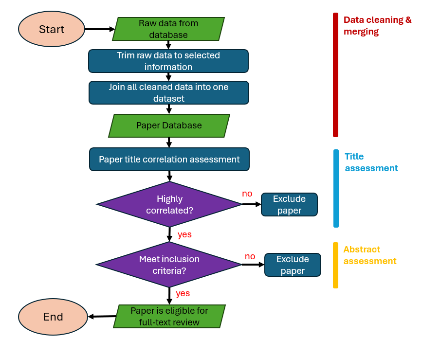

# Systematic Review Contribution of Automatic Speed Enforcement in the Global South
This repository describes the steps for a systematic review of literature assessing the efffectiveness of Automated Speed Enforcement in Lower and Middle Income countries. The review currently contains xx journal papers, conference papers and official government documents accessible for public. This repo is created as reference for data cleaning, title assessment and abstract assessment process during screening. 

The following image shows the complete process of data screeening: 
<p align="center">
  
</p>

## Data Merging & Cleaning
Raw data are collected from database search result using key terms describe in the paper. The file **
Raw data from each database are trimmed to only include the following information / columns: 

```python
- Authors                : all paper authors
- Title                  : paper titles
- Title_2                : additional identifier of paper title
- Record_link            : first URL of document
- DOI                    : Digital identifier
- Year                   : Publication year of paper
```
Then this data are compiled for assessment of title correlation. 
Compiled data is called: **database_title_final_df.xlsx**

## Title correlation 

- Broad topics associated with ASE-systems are clustered to create a commonly used expression for ASE-paper
 
- These expressions are used to create a unique list of words most used in ASE papers.

- From the combinations of these expressions, each word is extracted and stored in a unique list to avoid duplicates, forming a bag of words (BOW)

- he BOW is used to assess the correlation of paper titles.


